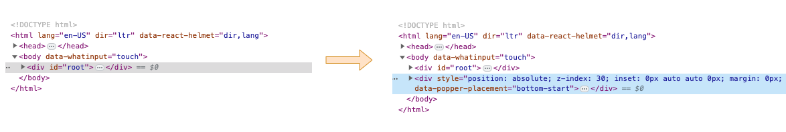
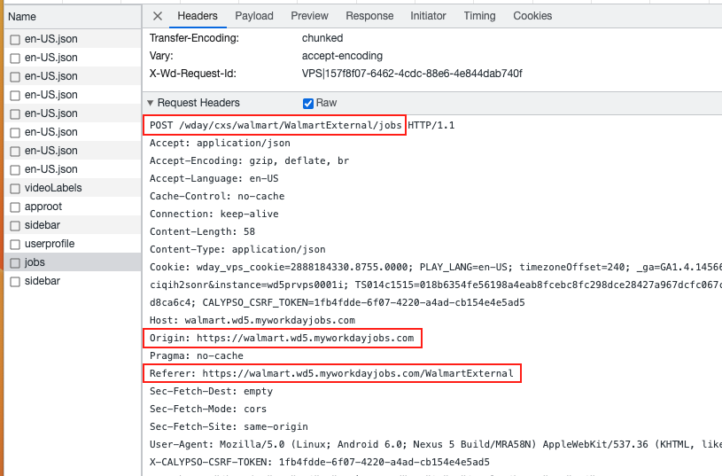
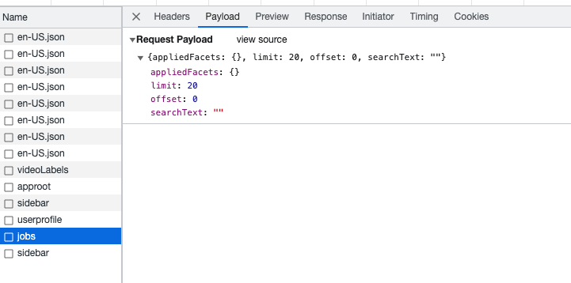

# Overview
After exploring, I found the "myworkdayjobs" is a SPA and everytime when we search for job positions, it will call an API to get the result. The class `MyWorkDayJobs` mimic the process to fetch the API and get the result automatically.

# Exploration on Each Page
## Search Job Pages
### Pagination
Navigating between different pages on their job search interface does not alter the URL, suggesting that the website employs a Single Page Application (SPA) framework or a comparable client-side rendering mechanism. Upon inspecting the network activity, it's evident that while the endpoint remains consistent, distinct parameters accompany each API request during page transitions.

### Dropdown List

After selecting the "Location" button, a dropdown menu appears with various locations. To extract the location data along with their corresponding IDs, it's essential to determine the origin of this data. We've identified three potential sources:

1. **Dynamic API Calls**: The location data might be fetched from a server in real-time.
   * Action: Navigate to the browser's developer tools and access the 'Network' tab. Filter the results by "fetch/XHR" to inspect potential API calls.
2. **Hidden Content**: The data could already be present within the page's HTML but set to be invisible using CSS.
   * Action: Examine the page's source code and look for any elements that may contain the data but are hidden.
3. **JavaScript Rendering**: The list could be dynamically rendered onto the page using JavaScript upon clicking the button. The rendering can stem from two types of JavaScript module imports:
   1. **Static Import**: The module is loaded initially at build time, they will typically be part of the initial chunks or bundles.
      * Action: Inspect the "Sources" tab in the browser's developer tools. Check the initially loaded JavaScript files or chunks to identify the module's content.
   2. **Dynamic Import**: The module isn't loaded initially but only when it's needed (at runtime), which means there would typically be **an additional network request** to fetch that module.
      * Action: After opening the dropdown list, monitor the 'Network' tab in the browser's developer tools for any new JavaScript requests, indicating a dynamic import.

# TODO:
1. Update the class name from `loblaw` to `myworkdayjobs`.
2. `postedOn` filed should be a string instead of a date, or make the date to be at 00:00:00
3. It is better to find the `myworkdayjobs.json` configuration automatically.
   1. `apiUrl` and `originUrl` have the same prefix.
   2. `appliedFacets` use the closest `facetParameter` as the field name.
4. Run it everyday and compare the latest value with the database value, incremental increase.
5. Send an email for any new job positions.
6. Move myworkdayjobs to the `src` folder.

# Mechanism
1. **Initial Page Load**: Begin at the job search page. An example URL might be: `https://walmart.wd5.myworkdayjobs.com/WalmartExternal`. Upon first loading this page, a request is made. Below are the details of this request:
* The Request Header: .
* The Payload: 
2. **Loading Facets**: The search button populates from the facets provided in the response. Once populated, you can click on options like 'location' or 'type' to see a dropdown list. The default job postings from the initial request will also be displayed.
3. **New Search Request**: When you modify the search criteria and search again, a new request is sent. This request's payload includes the following fields:
   1. `appliedFacets`: Contains details about `timeType` and location.
      1. The timeType can be directly acquired.
      2. For the location, to specify a location like `Ontario`, use the corresponding `facetParameter` as the key.
   2. `limit`: Specifies the number of job postings displayed on a single page, with a maximum of 20.
   3. `offset`: Indicates the starting point for the list of job postings.
   4. `searchText`: Describes the position you're searching for, e.g., "software engineer".