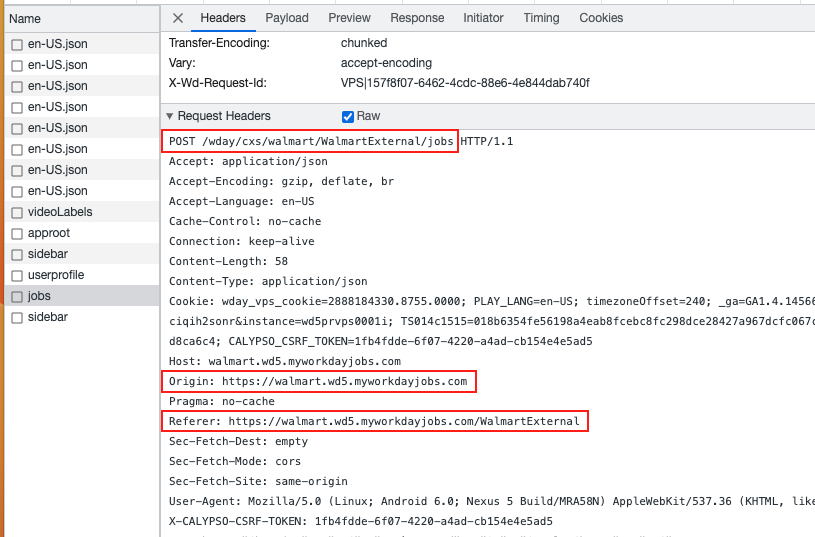
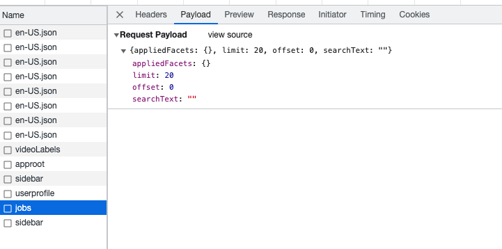

# Overview

# MyWorkDayJobs

## Completed
Get all "software engineer" or "full stack" job postings specified in the `myworkdayjobs/myworkdayjobs.json` file.

## How to use
### Add one record in the configure json file.
1. Navigate to MyWorkDayJobs Search Page:
   1. Open the specific company's MyWorkDayJobs job search page in your browser. Example: Navigate to `https://walmart.wd5.myworkdayjobs.com/WalmartExternal`.
2. Inspect the Page using Chrome Developer Tools:
   1. Activate the Chrome Developer Tools by right-clicking on the page and selecting `Inspect`.
   2. Navigate to the `Network` tab.
   3. From the filter dropdown, select `fetch/XHR` to view only fetch/XHR requests.
   4. Refresh the job search page.
      1. This action will populate the `Network` tab with recent network requests.
   5. Look for the request named `jobs` from the list.
      1. **Header Information**: Under the "Headers" section, scroll until you find "Request Headers". Here, check `Raw`. The API URL will be displayed on the first line. .
      2. **Payload Information**: You can find the necessary payload under the "Payload" section. .
3. Extract Facets using Postman:
   1. Launch `Postman` and create a new request.
      1. Paste the previously extracted API URL into the request URL field.
      2. Set the request method to `POST`.
   2. Paste the extracted payload into the body of the request.
      1. Make sure you select `raw` and `JSON` format.
   3. Click `Send`. The results will be displayed in the response section.
4. Update Configuration in `myworkdayjobs/myworkdayjobs.json`:
   1. `companyName`: This is a human-readable representation of the company name. Example: "walmart".
   2. `apiUrl`: Fill in the URL that you used in Postman.
   3. `appliedFacets`: This section often contains details about `timeType` and location. To identify the location value, search for a keyword such as `Ontario` in the Postman response. The associated ID will be your value. The key should be its closest associated `facetParameter`, "locationRegionStateProvince" in this example.
   4. `originUrl`: To retrieve this URL, open a specific job's application page. Even if you're redirected to a login page, copy the part of the URL preceding the term "login". 